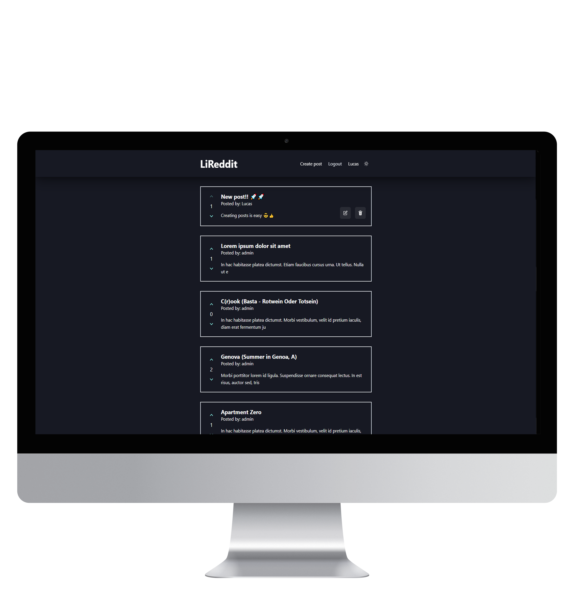
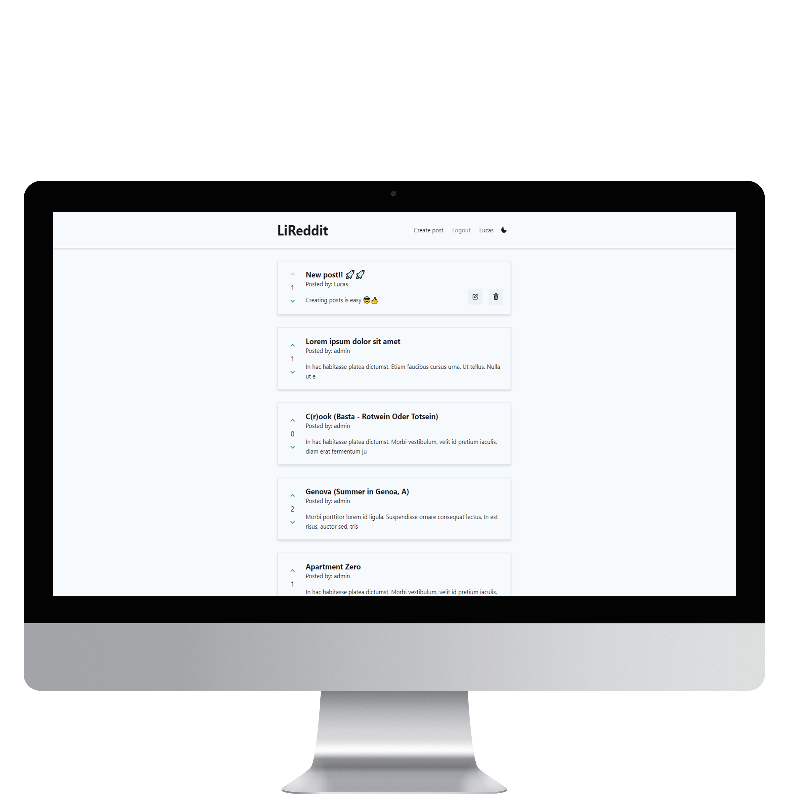

# LiReddit

  
  
  

  
  
  
  

  
  

# :books: Project

## LiReddit is a [Reddit](https://www.reddit.com) clone focusing on the functionality. 

 

### This project contains a Next frontend, using URQL to do Server Side Rendering on certain pages, as well as request caching. For a better developer experience, its used graphql-codegen to generate hooks for the queries and mutations, while for great UI/UX, Chakra UI is used.

 

### On the server, it features a GraphQL API using TypeGraphQL for the schema creation, Apollo Server for data-fetching and resolver development, redis to store the session cookie, nodemailer to send automatic emails, TypeORM as a query builder and general database interactions and dataloader for batching and caching data-fetching requests.

 

## 💻 Technologies

The project was built using the following technologies:

- [Typescript](https://www.typescriptlang.org)
- [Next](https://nextjs.org)
- [React](https://reactjs.org/)
- [Chakra UI](https://chakra-ui.com/)
- [Formik](https://formik.org)
- [URQL](https://formidable.com/open-source/urql/)
- [TypeORM](typeorm.io)
- [TypeGraphQL](https://typegraphql.com/docs/introduction.html)
- [Apollo Server](https://www.apollographql.com/docs/apollo-server/)
- [Nodemailer](https://nodemailer.com/about/)
- [Redis](https://redis.io)
- [Graphql Code Generator](https://graphql-code-generator.com)
- [Argon2](https://www.argon2.com)
- [DataLoader](https://github.com/graphql/dataloader)

### 📝 This project is not deployed, I can provide a video showing its functionalities if requested.

Made with ❤️ by Lucas Sierota